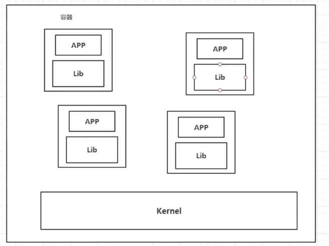

# 概述

## docker为什么会出现？

针对一款产品，需要经历以下生命周期：

开发---->上线。

这就牵扯到了两套环境，需要考虑应用环境的配置。

开发到运维之间就产生了一个问题：

在开发的电脑环境中可以运行，或者版本更新之后，导致服务不可用。对运维来说，考验就很大了。因为环境配置是十分的麻烦的，每一个机器都要部署环境，费时费力。

这就引出了一个问题：

我们能不能发布一个项目的时候，带上环境安装打包？

docker就提出了一个解决方案，开发打包部署上线，一套流程。

docker的思想来自于集装箱，原本传统项目中，多个应用会造成端口冲突，因为他们原来是交叉的；

而docker采用隔离思想，将各个应用打包装箱，每个箱子是相互隔离的。

总结：docker通过隔离机制，可以将服务器利用到极致。

## docker历史

2010年，几个搞IT的年轻人，就在美国成立了一家公司 dotCloud，做一些pass的云计算服务，以及lxc有关的容器技术。

他们将自己的技术（容器化技术）命名为docker。和所有初创公司一样，docker刚刚诞生的时候，并没有引起行业的注意，dotcloud是一个很小的公司，濒临崩溃。

这个时候，创始人做了一个很重要的决定，开源自己的代码。

2013年，docker开源了。

越来越多的人发现了docker的强大便捷之处，那个时候他每个月都会更新一个版本。

2014年4月9日，docker1.0发布了。

docker为什么这么火呢？比起传统的虚拟机，他是十分轻巧的。

值得一提的是，在容器技术出来之前，我们都是使用虚拟机技术，例如我们可以通过VMware虚拟出一台或者多台电脑，缺点是比较笨重。docker容器技术，也是一种虚拟化技术，但他镜像十分小巧。

到现在，所有开发人员都必须学会docker的使用。

## 关于docker

docker是基于go语言开发的开源项目。

官方文档：[Reference documentation | Docker Documentation](https://docs.docker.com/reference/)

仓库地址：[Docker Hub](https://hub.docker.com/)

## docker应用

容器化技术不是模拟的一个完整的操作系统。

docker与传统虚拟技术的不同：

- 传统的虚拟机，虚拟出一套硬件，运行一个完整的操作系统，然后在这个系统上安装和运行软件
- 容器内的应用直接运行在宿主机的内容，容器是没有自己的内核的，也没有虚拟硬件，所以更加轻便
- 每个容器间相互隔离，每个容器内都有一个属于自己的文件系统，互不影响

应用了docker，应用就可以更快速的交付和部署，并且可以更加便捷的升级和扩缩容，部署应用就和搭积木一样简单。

容器化之后，开发、测试环境都是高度一致的，并且可以更加高效的利用计算资源。

docker是内核级别的虚拟化，可以在一个物理机上运行很多的容器实例。服务器的性能可以被压榨到极致。

# 安装

## docker的基本组成

从左至右分别是客户端、服务器以及仓库。

镜像（image）

docker镜像就好比是一个模板，可以通过这个模板来创建容器服务。

或者说，镜像就像是一个压缩包，他把容器打包保存，使用的时候解包就可以直接使用。

例如，tomcat镜像---->run---->tomcat01容器（提供服务器），通过这个镜像可以创建多个容器（最终服务运行或者项目运行就是在容器中的）。

容器（container）

docker利用容器技术，独立运行一个或者一组应用，通过镜像来创建的。

目前可以把这个容器理解为是一个简易的Linux系统。

或者说，镜像就像是光盘，容器就是用光盘装好的系统。

仓库（repository）

仓库就是存放镜像的地方，分为共有仓库和私有仓库，国内阿里云等公司都有容器服务器，但需要配置镜像加速，否则速度是很慢的。

安装过程省略。

## hello-world

所有的命令都是通过docker run来运行的。

`docker run hello-world`

启动过程：

1. 首先在本机寻找镜像，如果有，则直接使用这个镜像运行
2. 如果没有，就去docker hub上下载。如果有，则下载到本地并运行
3. 如果docker hub也没有，则返回错误，找不到该镜像

底层原理

docker是怎么工作的？

docker是一个client-server结构的系统，docker的守护进程运行在主机上，通过socket从客户端访问。

dockerserver接收到docker-client的指令，就会执行这个命令。

docker为什么比vm快？

1. docker有着比虚拟机更少的抽象层

2. docker利用的是宿主机的内核，vm需要是centos7

   所以说，新建一个容器的时候，docker不需要像虚拟机一样重新加载一个操作系统内核，避免引导。虚拟机是加载centos，分钟级别的，而docker是利用宿主机的操作系统，省略了这个复杂的过程，秒级启动。

